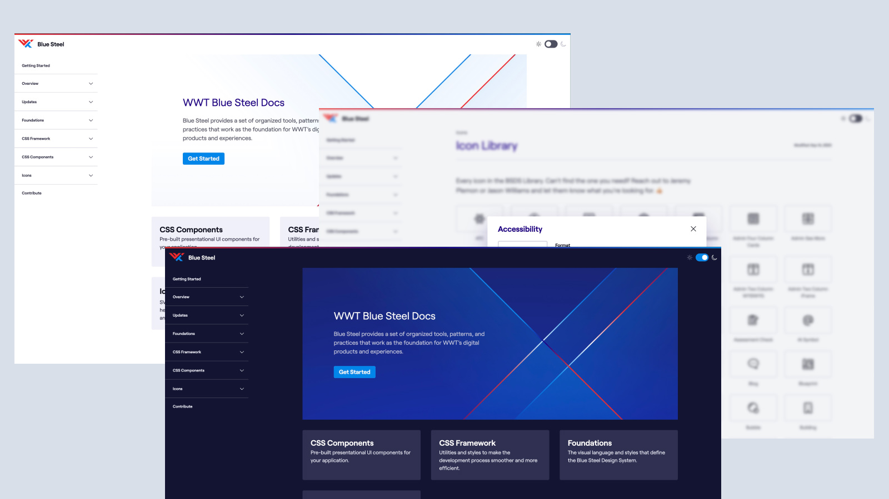

In my times at WWT, there were several iterations of the Blue Steel Design System — yes, it was named after Derek Zoolander. The first version happened shortly after I got to WWT. The second version happened after the company rebranded, and the third after I switched into the UX Architect role. There wasn't anything terribly wrong with the first two versions, but the needs of the team and the company had changed, so we started over, because sometimes it's easier to blow things up and begin again. Really in this case, there weren't many teams using Blue Steel 2, and the design didn't have to change so it was all about how we built it.

## The plan
WWT is primarily a Vue shop, but we had requests and needs to build components in Vue, React, and other frameworks like Svelte. Because there were so many needs, we took a step back to figure out the best plan of attack, and we decided on a CSS Framework followed by components (built and generated) in Vue, React, and web components. Personally, I LOVE web components.

Starting with CSS for a design system was a bit of a strange decision in 2022, but I was confident that it would have the biggest and fastest impact for the company. Previously, the company used [Tailwind](https://tailwindcss.com/), and while we weren't getting rid of it, we found that there were times that it caused more harm than good — that rebrand was rough. So we needed a different plan, and it had to more than tokens. Enter [Every Layout](https://every-layout.dev/) and [Cube CSS](https://cube.fyi/).

The idea was build a CSS framework that more flexible and foundational than utility classes without having to write and name everything. These two methodologies help to do that. We still used Tailwind as our utility class framework and generator, but we tried to rely on it a lot less through the project.

## Benefits of CSS
In the end, there were a lot of benefits of doing a CSS first approach. By using composition classes and [fluid type](https://utopia.fyi/), we were able to get rid of the vast majority of media queries, embrace the cascade, and create a simple reusable CSS api. This is now used to help build framework specific components without the need write the CSS for each framework.

The CSS could also be imported as a separate package and this allowed us to launch and test the product early, even getting it into production applications.

## Examples
Personally, I believe that CUBE CSS is worth your time and something you should read about. It takes a little getting used to, but at the end of the day, I think it helped to build really solid from components. Compositional classes, the main part of CUBE CSS, might seem strange to some. They seem like utility classes in a way, but they do a lot more.

### Flow
Let's take a look at the `.flow` composition.

```css
.flow > * + * {
  margin-top: var(--flow-space, 1.5em);
}
```

`.flow` uses the [Lobotomized Owl](https://alistapart.com/article/axiomatic-css-and-lobotomized-owls/) selector to select all direct children of `.flow` that are proceeded by another element. Then we apply a `margin-top` to those children. We're using a CSS custom property with a default/fallback if a value isn't provided. Notice that the fallback uses relative sizing so it is different for each child. There are so many ways we can expand this and handle edge cases while still embracing vertical rhythm.

### Badge Component
From the CSS component side of this, let's look at Badges. Badges are used to show counts or general notifications. This one CSS component allows us to include color, position, count, and style of badge. This is done through the use of data attributes. Data attributes are protected in frameworks so it's totally safe to use, and is a great way to pass and consume data. Dive into this Codepen to see how we made this happen.

<p class="codepen" data-height="300" data-theme-id="39872" data-default-tab="css,result" data-slug-hash="poaxeaM" data-user="davidleininger" style="height: 300px; box-sizing: border-box; display: flex; align-items: center; justify-content: center; border: 2px solid; margin: 1em 0; padding: 1em;">
  <span>See the Pen <a href="https://codepen.io/davidleininger/pen/poaxeaM">
  Notification/Badge CSS using data attributes.</a> by David Leininger (<a href="https://codepen.io/davidleininger">@davidleininger</a>)
  on <a href="https://codepen.io">CodePen</a>.</span>
</p>
<script async src="https://cpwebassets.codepen.io/assets/embed/ei.js"></script>

_**Note:** in CUBE CSS a component would be a "Block". That's the B in CUBE. The more you know..._

## Documentation FTW
Building a design system or API is only as good as the documentation. If you build an amazing tool, but no one know how to use it, then it isn't very good. We spent a lot of time making sure our documentation site was accessible, easy to use, and easy to understand. Writing documentation is hard, but so worth it. I'm really proud of where we landed.



## Generating Components
One of my favorite parts of the project was generating components. The first place that we did this was with icons. I wrote a scrip that:

1. Downloaded and optimized all of the icons from Figma
1. Created a JSON file that stored all of the icon code and metadata and allowed for deprecating icons that was no longer maintained
1. Generated web components, Vue, and React components for each icon
1. Generated the icon page in the docs that allowed users to preview the icon and select the type of icons they wanted and copy or download the necessary code


This was one of the most fun parts of this entire project. Since leaving WWT, I've built a very similar script and import for the New York Times design system.

## My Contributions:
Design direction, building CSS framework, building the documentation site and writing docs, building and generating components, auditing everything for accessibility, and teaching others how to use the system.
