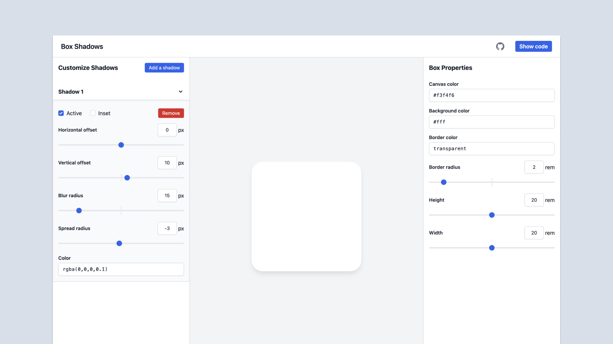

[Box Shadows](https://box-shadow.dev/) is a tiny helper tool that helps developers visualize and generating code for box-shadows. It allows users to add multiple box-shadows and control the size and shape of the element with the shadow.

The guts of this app was built by my buddy [Mike McBride](https://mikemcbride.dev). I came in to help with usability and accessibility.

## Similar Projects
Box Shadows is a project by [Two Beards](https://twobeards.dev), a little side project I'm doing with Mike. We also built [flexbox.tech](https://flexbox.tech), a flexbox playground to help you better understand how to make flexbox layouts. We're cooking up a few other ideas as well.
