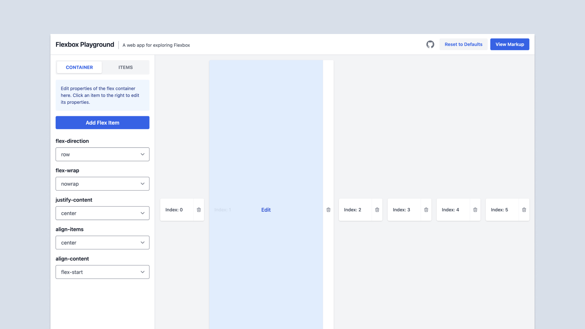

[Flexbox.tech](https://flexbox.tech/) is a flexbox playground to help you better understand how to make flexbox layouts. This is a tiny helper tool allows uses to add items to a flex container and adjust properties on the container or individual elements. This helps developers to understand how flexbox works by being able to change every property.

The bulk of this app was built by my buddy [Mike McBride](https://mikemcbride.dev). I came in to help with design, usability, and accessibility.

## Similar Projects
Flexbox.tech is a project by [Two Beards](https://twobeards.dev), a little side project I'm doing with Mike. We also built [box-shadow.dev](https://box-shadow.dev), a tool to help developers visualize and generate `box-shadow` code. We're cooking up a few other ideas as well.
