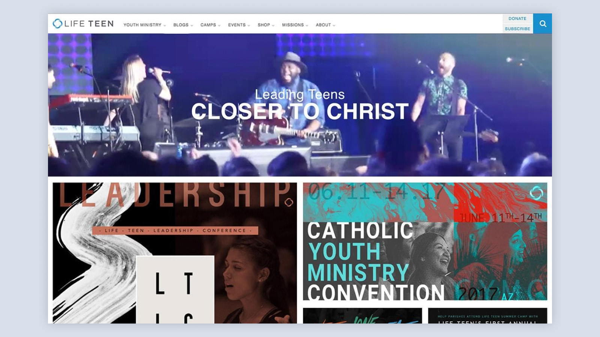
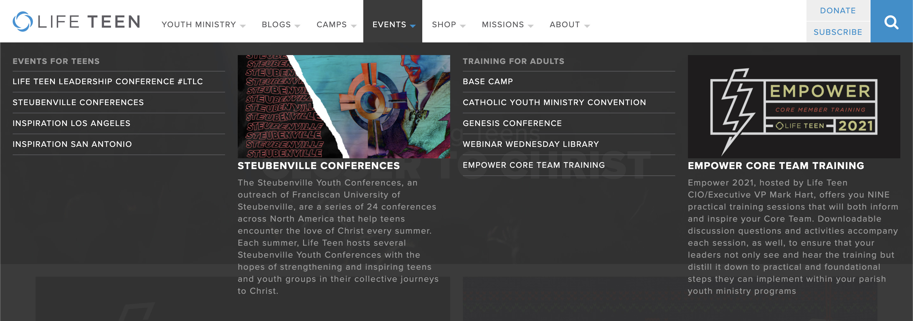
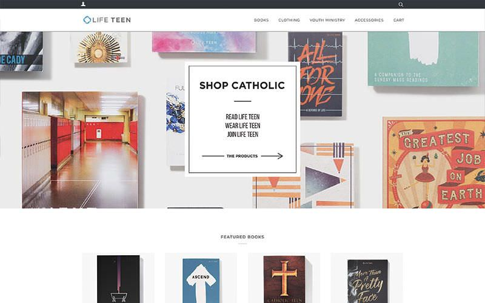
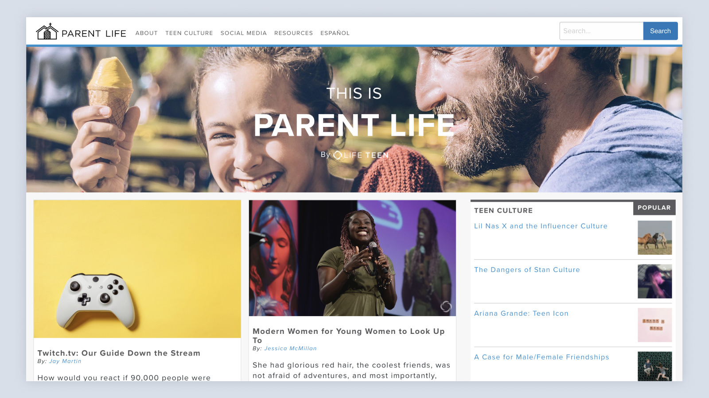

The main [Life Teen](https://lifeteen.com) website was rebuilt in April of 2015 for Life Teen's 30th anniversary. At the time, the website got an average of 30,000 hits a day, but I'm sure it's more now. The CEO wanted to make sure that our site was constantly changing, so I came up with ad grid on the homepage giving us the opportunity to change content and layout on a regular basis while featuring our events, resources, and products that were relevant the the specific user.

One of the biggest challenges with this site was the navigation. With so many different types of users and content, we needed a solution that would work for everything. We worked on a lot of iterations and landed on a mega menu that would allow the user quick access to whatever they might be looking for.

I worked on the Life Teen website and other web apps for four years. We release 10 different native and web apps in that time frames, and I was over all of them, from planning, to design, to dev. If it was a technical project while I was there, I worked on it. While most of the content has changed, the bones are there for a lot I was a part of, like the [Life Teen Online Store](https://shop.lifeteen.com), 30th anniversary rebranding, and [Parent Life](https://ltparentlife.com).

## My Contributions:
I was one of the key contributors to the rebrand that happened for the 30th anniversary. I ran event production, whether that I was running screens, a camera, or calling the show. I designed and developed the old lifeteen.com, Parent Life, the Life Teen Store, A native Life Teen library app, [The Victory App](/work/victory), and many more things. I designed in XD and Sketch, I prototyped the designs with Invision, and built many of the sites and apps with wordpress or Gatsby.
